# Employee Management System

A full-stack Employee Management System built using Angular, Spring Boot, and MySQL. This application allows users to perform complete CRUD (Create, Read, Update, Delete) operations on employee records through a modern and responsive user interface.

## Features

* View all employees
* Add new employees
* Update existing employee details
* Delete employees
* Search employees by first name or last name
* Responsive and modern UI using Tailwind CSS
* RESTful API integration between Angular and Spring Boot
* MySQL database persistence

## Tech Stack

### Frontend

* Angular
* TypeScript
* Tailwind CSS
* Angular Router
* Angular Forms
* HttpClient

### Backend

* Spring Boot
* Spring Data JPA
* Hibernate
* Maven

### Database

* MySQL

## Project Structure

```text
employee-crud-application/
│
├── backend/
│   │
│   ├── .mvn/
│   │   └── wrapper/
│   │       └── maven-wrapper.properties
│   │
│   ├── src/
│   │   ├── main/
│   │   │   ├── java/
│   │   │   │   └── com/
│   │   │   │       └── adithya_naik/
│   │   │   │           └── employee_crud_application/
│   │   │   │               ├── controller/
│   │   │   │               │   └── EmployeeController.java
│   │   │   │               ├── entity/
│   │   │   │               │   └── Employee.java
│   │   │   │               ├── repository/
│   │   │   │               │   └── EmployeeRepository.java
│   │   │   │               └── EmployeeCrudApplication.java
│   │   │   │
│   │   │   └── resources/
│   │   │       └── application.properties
│   │   │
│   │   └── test/
│   │       └── java/
│   │
│   ├── .gitattributes
│   ├── .gitignore
│   ├── mvnw
│   ├── mvnw.cmd
│   ├── pom.xml
│   └── README.md
│
├── frontend/
│   │
│   ├── public/
│   │   └── favicon.ico
│   │
│   ├── src/
│   │   ├── app/
│   │   │   ├── create-employee/
│   │   │   │   ├── create-employee.component.css
│   │   │   │   ├── create-employee.component.html
│   │   │   │   └── create-employee.component.ts
│   │   │   │
│   │   │   ├── update-employee/
│   │   │   │   ├── update-employee.component.css
│   │   │   │   ├── update-employee.component.html
│   │   │   │   └── update-employee.component.ts
│   │   │   │
│   │   │   ├── list-employee/
│   │   │   │   ├── list-employee.component.css
│   │   │   │   ├── list-employee.component.html
│   │   │   │   └── list-employee.component.ts
│   │   │   │
│   │   │   ├── header/
│   │   │   │   ├── header.component.css
│   │   │   │   ├── header.component.html
│   │   │   │   └── header.component.ts
│   │   │   │
│   │   │   ├── footer/
│   │   │   │   ├── footer.component.css
│   │   │   │   ├── footer.component.html
│   │   │   │   └── footer.component.ts
│   │   │   │
│   │   │   ├── app.component.css
│   │   │   ├── app.component.html
│   │   │   ├── app.component.ts
│   │   │   ├── app.config.ts
│   │   │   ├── app.routes.ts
│   │   │   ├── employee.service.ts
│   │   │   └── employee.ts
│   │   │
│   │   ├── index.html
│   │   ├── main.ts
│   │   └── styles.css
│   │
│   ├── .editorconfig
│   ├── .gitignore
│   ├── .postcssrc.json
│   ├── angular.json
│   ├── package.json
│   ├── package-lock.json
│   ├── tsconfig.json
│   ├── tsconfig.app.json
│   ├── tsconfig.spec.json
│   └── README.md
│
├── .gitignore
├── README.md
└── screenshots/
    ├── employee-list.png
    ├── add-employee.png
    └── update-employee.png

```

## API Endpoints

| Method | Endpoint        | Description        |
| ------ | --------------- | ------------------ |
| GET    | /employees      | Get all employees  |
| GET    | /employees/{id} | Get employee by ID |
| POST   | /employees      | Create employee    |
| PUT    | /employees/{id} | Update employee    |
| DELETE | /employees/{id} | Delete employee    |

## Getting Started

### Backend Setup

1. Navigate to the backend directory.

```bash
cd backend
```

2. Configure MySQL credentials in `application.properties`.

3. Run the Spring Boot application.

```bash
mvn spring-boot:run
```

The backend server will start on:

```text
http://localhost:8080
```

### Frontend Setup

1. Navigate to the frontend directory.

```bash
cd frontend
```

2. Install dependencies.

```bash
npm install
```

3. Start the Angular development server.

```bash
ng serve
```

The frontend application will be available at:

```text
http://localhost:4200
```

## Database Example

```sql
INSERT INTO employees (first_name, last_name, salary) VALUES
('Rahul', 'Sharma', 65000),
('Priya', 'Reddy', 72000),
('Arjun', 'Patel', 58000);
```

## Screenshots
### Read Employee / Dashboard
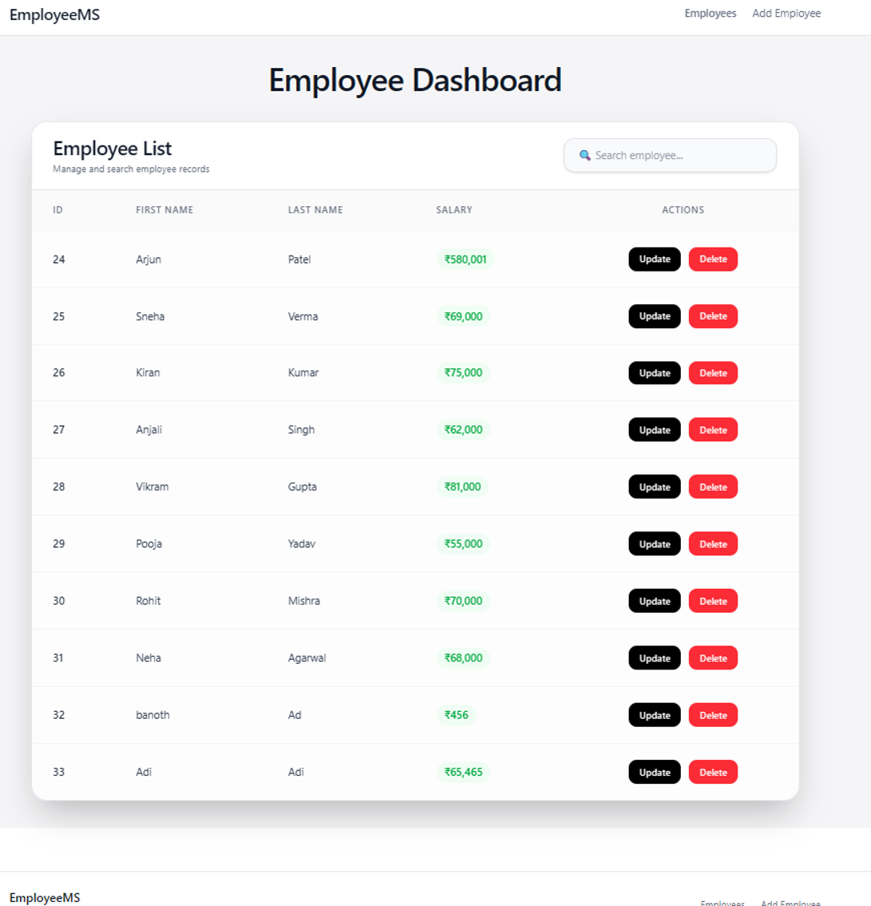
### Add Employee
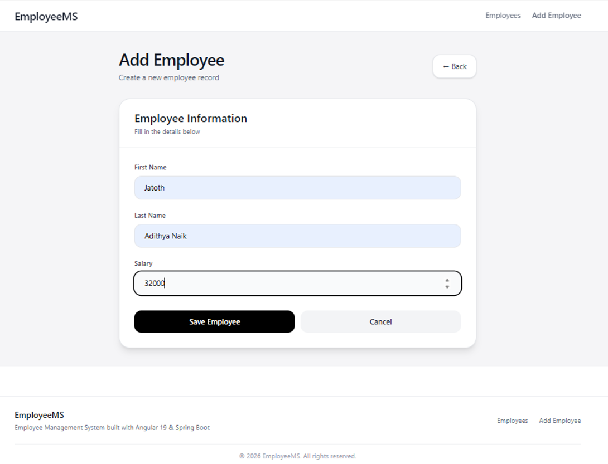
### Employee Created Successfully
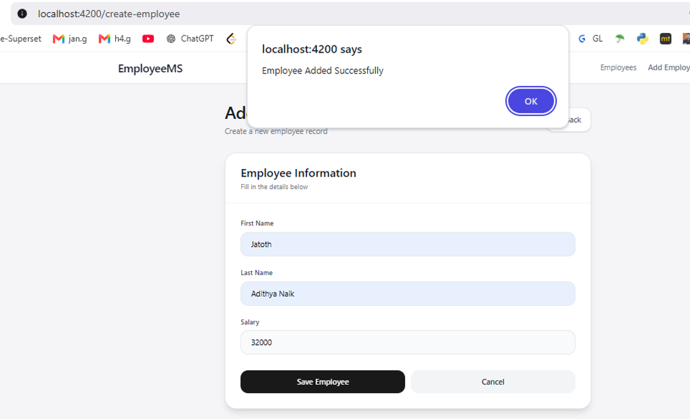
### Search Employee
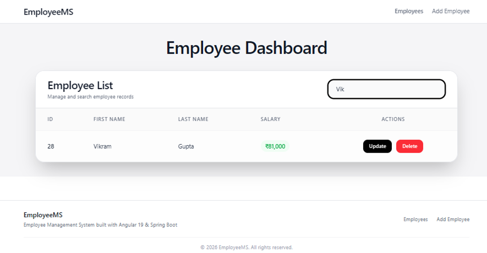
### Update Employee
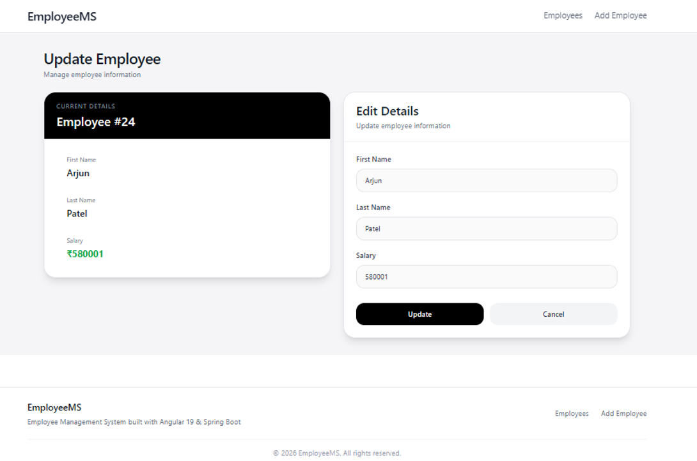
### Update Employee Successfully
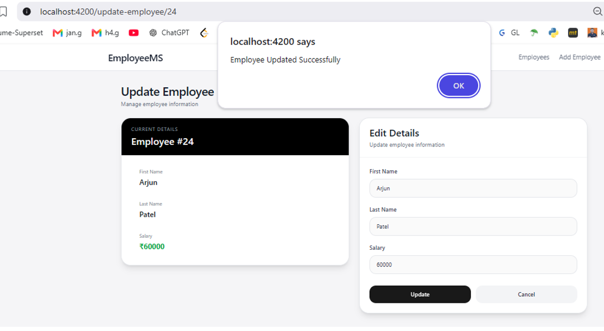
### Delete Employee
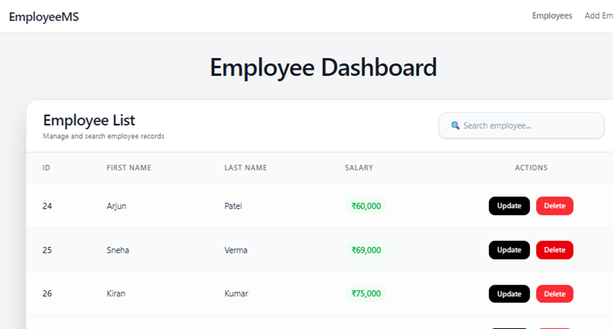
### Delete Employee Successfully
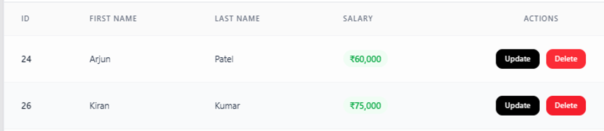
### GET Employee
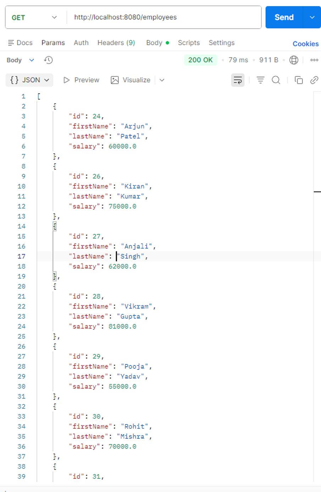
### GET Employee by ID
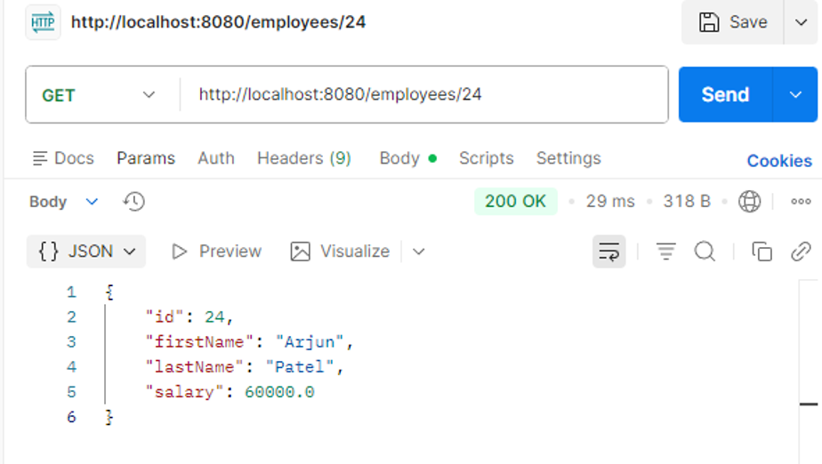
### POST Employee
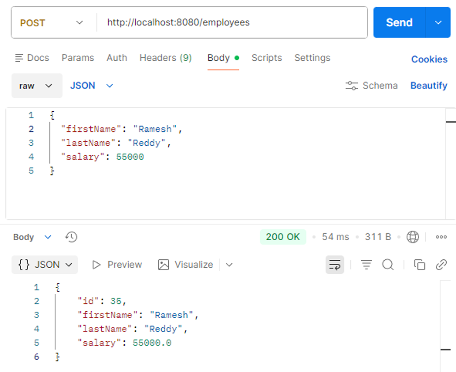
### PUT Employee
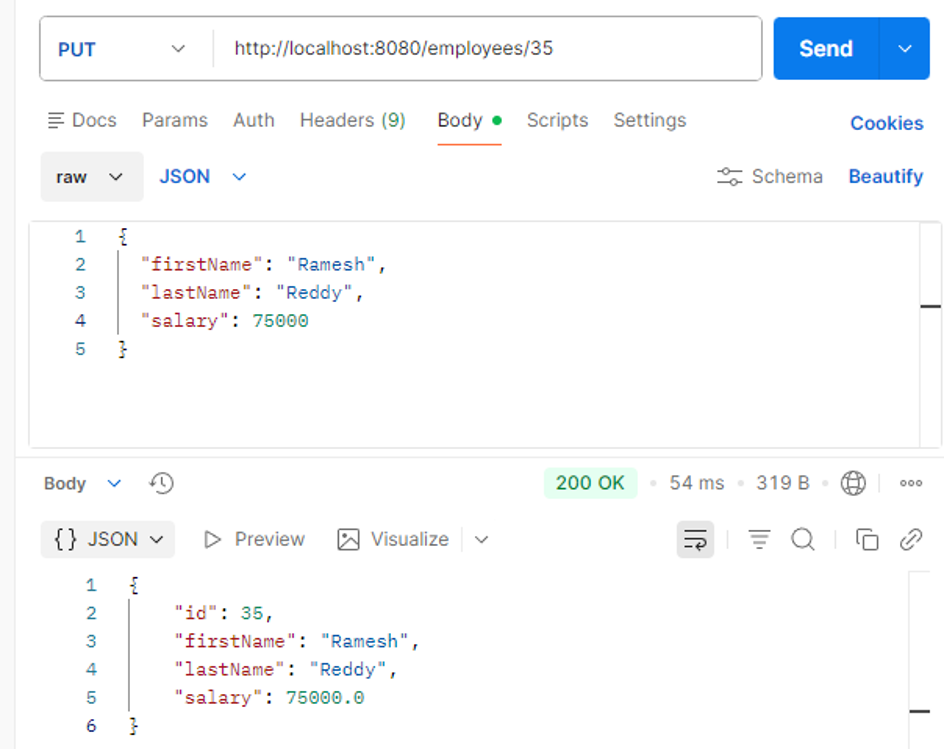
### DELETE Employee
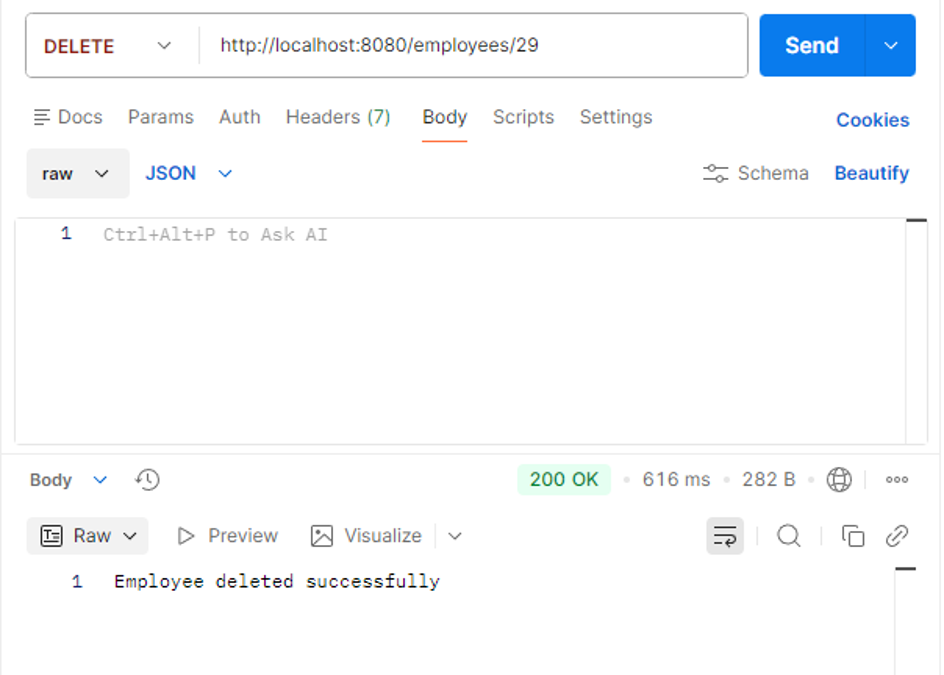

## Future Improvements
* Pagination
* Sorting
* Employee profile page
* Authentication and authorization
* Toast notifications
* Docker support
* Deployment to cloud platforms

## Author

**Jatoth Adithya Naik**

* GitHub: https://github.com/adithya-naik
* LinkedIn: https://linkedin.com/in/adithyanaik
* Portfolio: https://adithya-naik.netlify.app

## License

This project is intended for learning and portfolio purposes.
