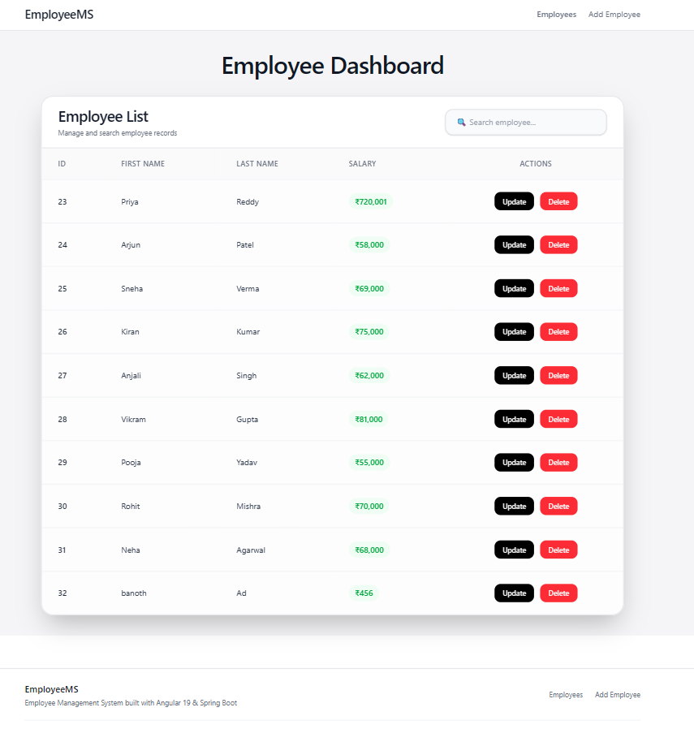
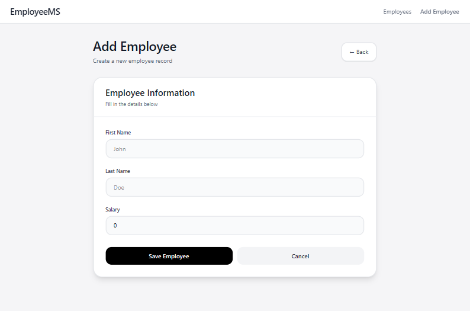
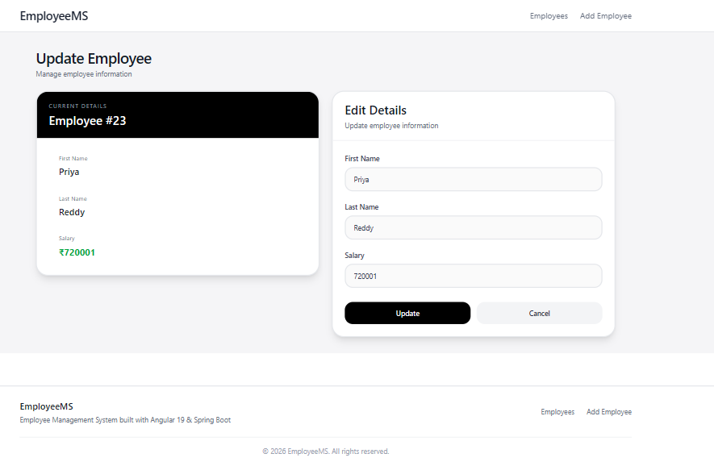

# Employee Management System

A full-stack Employee Management System built using Angular, Spring Boot, and MySQL. This application allows users to perform complete CRUD (Create, Read, Update, Delete) operations on employee records through a modern and responsive user interface.

## Features

* View all employees
* Add new employees
* Update existing employee details
* Delete employees
* Search employees by first name or last name
* Responsive and modern UI using Tailwind CSS
* RESTful API integration between Angular and Spring Boot
* MySQL database persistence

## Tech Stack

### Frontend

* Angular
* TypeScript
* Tailwind CSS
* Angular Router
* Angular Forms
* HttpClient

### Backend

* Spring Boot
* Spring Data JPA
* Hibernate
* Maven

### Database

* MySQL

## Project Structure

```text
employee-crud-application/
├─ .idea/
│  ├─ compiler.xml
│  ├─ encodings.xml
│  ├─ jarRepositories.xml
│  ├─ misc.xml
│  ├─ vcs.xml
│  └─ workspace.xml
├─ backend/
│  ├─ .idea/
│  │  ├─ .gitignore
│  │  ├─ compiler.xml
│  │  ├─ encodings.xml
│  │  ├─ jarRepositories.xml
│  │  ├─ misc.xml
│  │  ├─ vcs.xml
│  │  └─ workspace.xml
│  ├─ .mvn/
│  │  └─ wrapper/
│  │     └─ maven-wrapper.properties
│  ├─ src/
│  │  ├─ main/
│  │  │  ├─ java/
│  │  │  │  └─ com/
│  │  │  │     └─ adithya_naik/
│  │  │  │        └─ employee_crud_application/
│  │  │  │           ├─ controller/
│  │  │  │           │  └─ EmployeeController.java
│  │  │  │           ├─ entity/
│  │  │  │           │  └─ Employee.java
│  │  │  │           ├─ repository/
│  │  │  │           │  └─ EmployeeRepository.java
│  │  │  │           └─ EmployeeCrudApplication.java
│  │  │  └─ resources/
│  │  │     ├─ static/
│  │  │     ├─ templates/
│  │  │     └─ application.properties
│  │  └─ test/
│  │     └─ java/
│  │        └─ com/
│  │           └─ adithya_naik/
│  │              └─ employee_crud_application/
│  │                 └─ EmployeeCrudApplicationTests.java
│  ├─ target/
│  │  ├─ classes/
│  │  │  ├─ com/
│  │  │  │  └─ adithya_naik/
│  │  │  │     └─ employee_crud_application/
│  │  │  │        ├─ controller/
│  │  │  │        │  └─ EmployeeController.class
│  │  │  │        ├─ entity/
│  │  │  │        │  └─ Employee.class
│  │  │  │        ├─ repository/
│  │  │  │        │  └─ EmployeeRepository.class
│  │  │  │        └─ EmployeeCrudApplication.class
│  │  │  └─ application.properties
│  │  └─ generated-sources/
│  │     └─ annotations/
│  ├─ .gitattributes
│  ├─ .gitignore
│  ├─ HELP.md
│  ├─ mvnw
│  ├─ mvnw.cmd
│  ├─ pom.xml
│  └─ README.md
├─ frontend/
│  ├─ .angular/
│  │  └─ cache/
│  │     └─ 19.2.27/
│  │        └─ frontend/
│  │           ├─ vite/
│  │           │  ├─ deps/
│  │           │  │  ├─ _metadata.json
│  │           │  │  ├─ @angular_common_http.js
│  │           │  │  ├─ @angular_common_http.js.map
│  │           │  │  ├─ @angular_common.js
│  │           │  │  ├─ @angular_common.js.map
│  │           │  │  ├─ @angular_core.js
│  │           │  │  ├─ @angular_core.js.map
│  │           │  │  ├─ @angular_forms.js
│  │           │  │  ├─ @angular_forms.js.map
│  │           │  │  ├─ @angular_platform-browser.js
│  │           │  │  ├─ @angular_platform-browser.js.map
│  │           │  │  ├─ @angular_router.js
│  │           │  │  ├─ @angular_router.js.map
│  │           │  │  ├─ chunk-3ZEMIUMS.js
│  │           │  │  ├─ chunk-3ZEMIUMS.js.map
│  │           │  │  ├─ chunk-5NUURRAO.js
│  │           │  │  ├─ chunk-5NUURRAO.js.map
│  │           │  │  ├─ chunk-J4XDVQTK.js
│  │           │  │  ├─ chunk-J4XDVQTK.js.map
│  │           │  │  ├─ chunk-NI5NM45N.js
│  │           │  │  ├─ chunk-NI5NM45N.js.map
│  │           │  │  ├─ chunk-QRA64KSI.js
│  │           │  │  ├─ chunk-QRA64KSI.js.map
│  │           │  │  └─ package.json
│  │           │  └─ deps_ssr/
│  │           │     ├─ _metadata.json
│  │           │     └─ package.json
│  │           └─ .tsbuildinfo
│  ├─ .vscode/
│  │  ├─ extensions.json
│  │  ├─ launch.json
│  │  └─ tasks.json
│  ├─ public/
│  │  └─ favicon.ico
│  ├─ src/
│  │  ├─ app/
│  │  │  ├─ create-employee/
│  │  │  │  ├─ create-employee.component.css
│  │  │  │  ├─ create-employee.component.html
│  │  │  │  ├─ create-employee.component.spec.ts
│  │  │  │  └─ create-employee.component.ts
│  │  │  ├─ footer/
│  │  │  │  ├─ footer.component.css
│  │  │  │  ├─ footer.component.html
│  │  │  │  ├─ footer.component.spec.ts
│  │  │  │  └─ footer.component.ts
│  │  │  ├─ header/
│  │  │  │  ├─ header.component.css
│  │  │  │  ├─ header.component.html
│  │  │  │  ├─ header.component.spec.ts
│  │  │  │  └─ header.component.ts
│  │  │  ├─ list-employee/
│  │  │  │  ├─ list-employee.component.css
│  │  │  │  ├─ list-employee.component.html
│  │  │  │  ├─ list-employee.component.spec.ts
│  │  │  │  └─ list-employee.component.ts
│  │  │  ├─ update-employee/
│  │  │  │  ├─ update-employee.component.css
│  │  │  │  ├─ update-employee.component.html
│  │  │  │  ├─ update-employee.component.spec.ts
│  │  │  │  └─ update-employee.component.ts
│  │  │  ├─ app.component.css
│  │  │  ├─ app.component.html
│  │  │  ├─ app.component.spec.ts
│  │  │  ├─ app.component.ts
│  │  │  ├─ app.config.ts
│  │  │  ├─ app.routes.ts
│  │  │  ├─ employee.service.spec.ts
│  │  │  ├─ employee.service.ts
│  │  │  ├─ employee.spec.ts
│  │  │  └─ employee.ts
│  │  ├─ index.html
│  │  ├─ main.ts
│  │  └─ styles.css
│  ├─ .editorconfig
│  ├─ .gitignore
│  ├─ .postcssrc.json
│  ├─ angular.json
│  ├─ package-lock.json
│  ├─ package.json
│  ├─ README.md
│  ├─ tsconfig.app.json
│  ├─ tsconfig.json
│  └─ tsconfig.spec.json
├─ .gitignore
└─ README.md

```

## API Endpoints

| Method | Endpoint        | Description        |
| ------ | --------------- | ------------------ |
| GET    | /employees      | Get all employees  |
| GET    | /employees/{id} | Get employee by ID |
| POST   | /employees      | Create employee    |
| PUT    | /employees/{id} | Update employee    |
| DELETE | /employees/{id} | Delete employee    |

## Getting Started

### Backend Setup

1. Navigate to the backend directory.

```bash
cd backend
```

2. Configure MySQL credentials in `application.properties`.

3. Run the Spring Boot application.

```bash
mvn spring-boot:run
```

The backend server will start on:

```text
http://localhost:8080
```

### Frontend Setup

1. Navigate to the frontend directory.

```bash
cd frontend
```

2. Install dependencies.

```bash
npm install
```

3. Start the Angular development server.

```bash
ng serve
```

The frontend application will be available at:

```text
http://localhost:4200
```

## Database Example

```sql
INSERT INTO employees (first_name, last_name, salary) VALUES
('Rahul', 'Sharma', 65000),
('Priya', 'Reddy', 72000),
('Arjun', 'Patel', 58000);
```

## Screenshots
### Employee List

### Add Employee

### Update Employee



## Future Improvements
* Pagination
* Sorting
* Employee profile page
* Authentication and authorization
* Toast notifications
* Docker support
* Deployment to cloud platforms

## Author

**Jatoth Adithya Naik**

* GitHub: https://github.com/adithya-naik
* LinkedIn: https://linkedin.com/in/adithyanaik
* Portfolio: https://adithya-naik.netlify.app

## License

This project is intended for learning and portfolio purposes.
